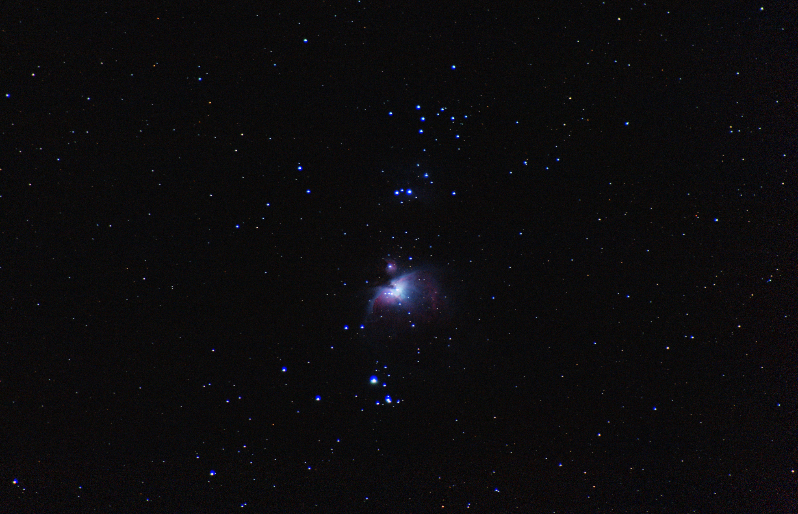
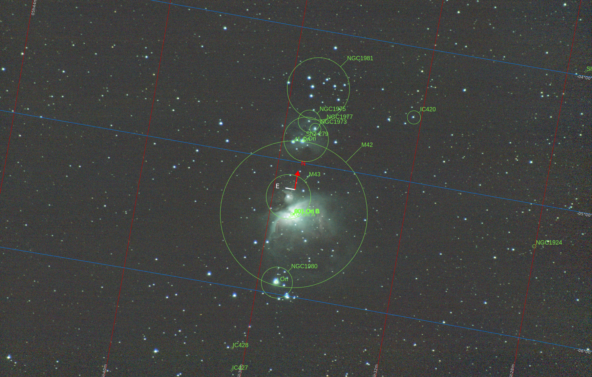
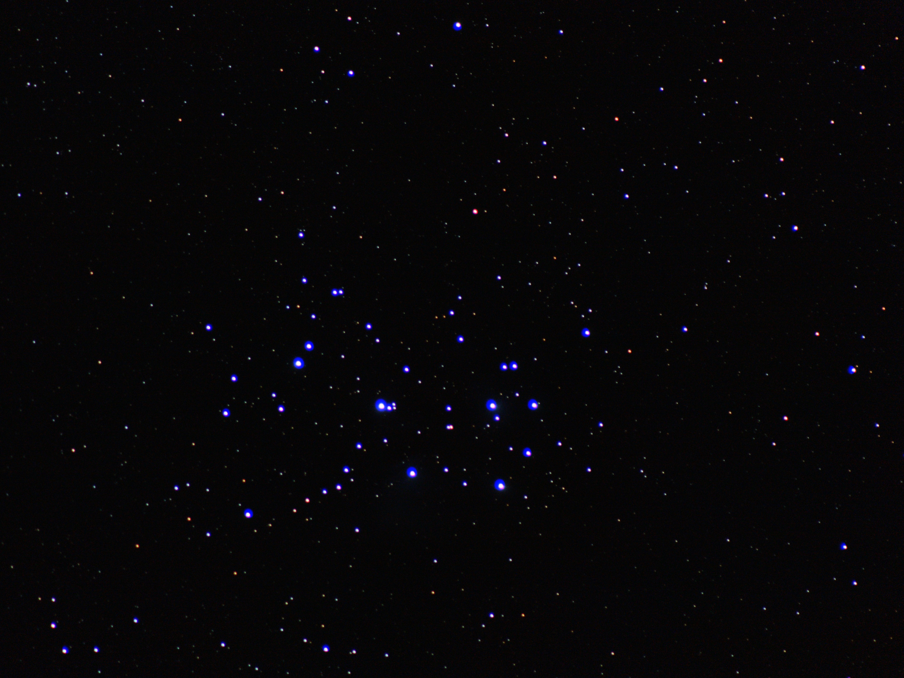
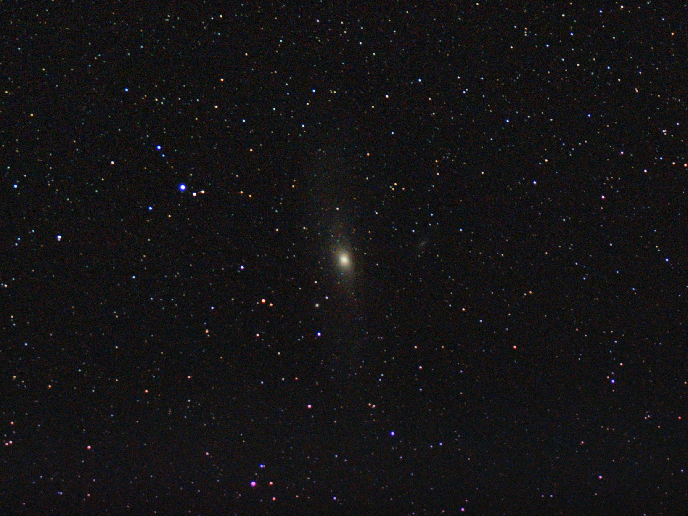
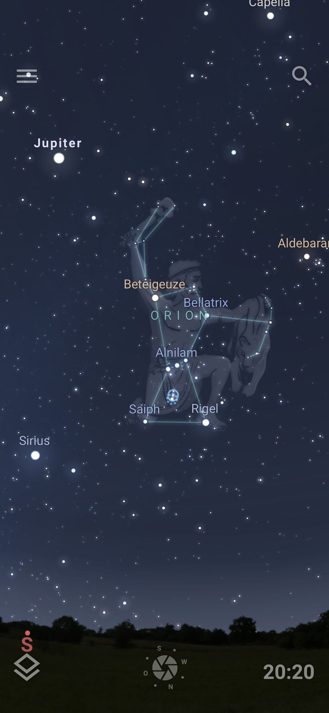
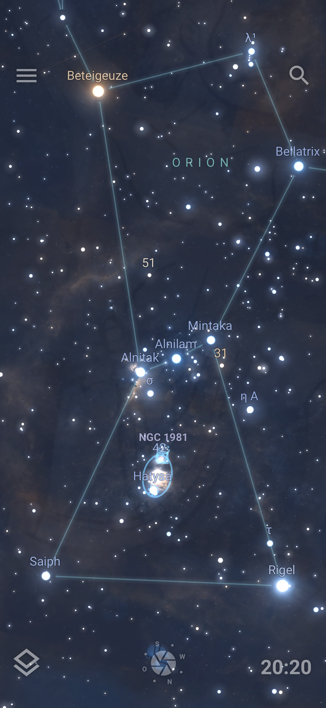
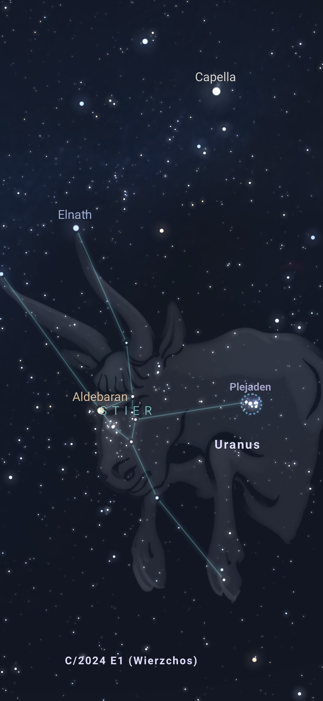
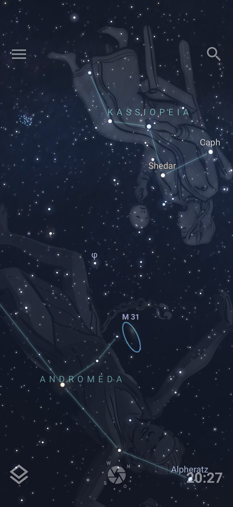
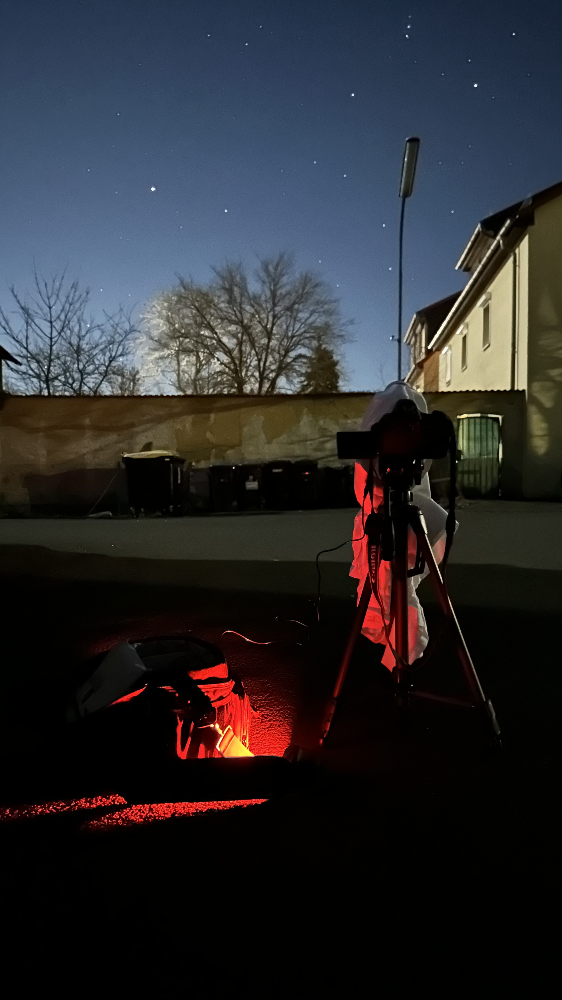
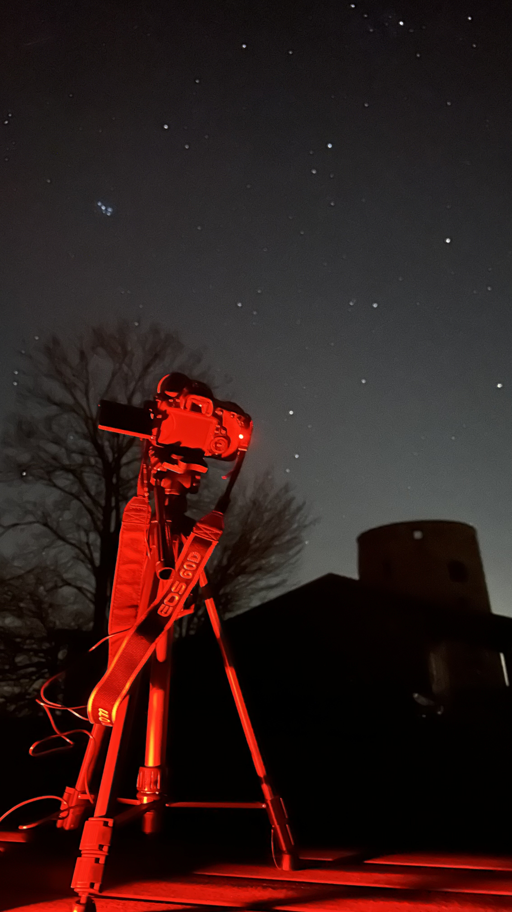

# Astrophotography

Ausrüstung
- DSLR (Canon EOS 60D)
- Objektiv (Kit Zoom Lens EF 75-300mm 1:4-5.6)
- Stativ
- Zeitauslöser (Intervalometer)
- Rotlicht Taschenlampe, weißes T-Shirt und Smartphone für Calibration Frames

Stellarium (App) für Orientierung am Nachthimmel
- https://stellarium.org/
- https://stellarium-web.org/

Karten für Lichtverschmutzung (Bortle classes)
- https://www.lightpollutionmap.info/
- https://lightpollutionmap.app/de/

---

# Kamera Einstellungen

- RAW → Post-Processing
- Ordner anlegen für: lights, darks, flats, biases
- Noise Reduction (NR) off
- [Daylight Whitebalance → unwichtig in RAW]

Manual Mode

AF Off (Manual Focus)

Aperture / Blende offen: f/5.6 (besser kleiner)

ISO: 1600 - 6400

Shutter Speed → ca. 1s Sub-Exposure ohne Tracking mit 300mm Brennweite und APS-C Sensor
- ["Rule of 500" and NPF-Formula](docs/exposure_times.md)

---

# Durchführung

Fokussierung auf Riegel (benutze digital zoom zur Kontrolle; der weiße Teil des Sterns muss möglichst klein sein); dann zoome heraus, suche den Orion Nebel und zoome wieder heran (ohne den Fokus zu verstellen)

Bulb Mode für Belichtungszeit = es wird so lange belichtet, so lange man den Auslöser gedrückt hält (dies wird jetzt vom Intervalometer vorgegeben)

Intervalometer: https://youtu.be/HerGWr3k06U

Light-Frames: >300 Fotos für Stacking

Calibration Frames: https://youtu.be/uIZtNCd5Ehs
- 50 Dark-Frames: same camera settings, same temperature, lens cap on; capture thermal noise from the sensor
- 30 Flat-Frames: set to A/V, same settings, T-Shirt, Phone (White Light); capture vignetting or dust present
- 50 Bias-Frames: shortest exposure (1/4000), lens cap on; capture the sensor readout noise

---

# Stacking and Post-Processing

OpenSource Software Siril: https://siril.org/

Stacking erhöht das "Signal to Noise Ratio (SNR)”. Die Belichtungen der Fotos (Sub-Exposures) werden addiert (Total Exposure)

Workflow:

Homeverzeichnis auswählen

Ordner richtig benennen: lights, darks, flats, biases

Einmalig:
- Skripte > Skripte laden (auswählen für GUI)
- Skripte > Siril Catalog Installer (Astrometrie, SPCC = Spectro Photometric Color Calibration)

Skripte > OSC Preprocessing (One Shot Color = Farbsensor)

Preprocessing (durch Skript, benötigt etwa 200GB freien Speicherplatz)
- Konvertierung: CR2 (RAW) → Fits, export als TIFF
- Kalibrierung
    - darks: Sensor Ausleserauschen, Hotpixel
    - flats: Vignettierung, Staub
    - biases: Grundrauschen
- Registrierung == Global Star Alignment
- Stacking (Winsorized Sigma Clipping)

Bildbearbeitung (manuell)
- Crop / Freistellen
- Background Extraction = Gradient entfernen (Skripte > Python > Processing > AutoBGE)
- Astrometrie = plate solving (Werkzeuge > Astronomie): M42 für Orion Neben; Pixelgröße = 4.29mm bei Canon EOS 60D: APS-C, 18MP
- Farbkalibrierung: Spectrophotometric Color Calibration (SPCC) (Bildbearbeitung > Farbkalibrierung)
- Histogram Stretching: VeraLux Hypermetric Stretch (Skripte > Python)
- Farbsättigung
- Kurventransformation (Bildbearbeitung > Streckung)
- [Debayering, RGGB Bayer Muster]

---

References

https://www.youtube.com/playlist?list=PLssH_Otzm89CpFYOq4RV7sKtZKzHKKYJw

https://de.wikipedia.org/wiki/Messier-Katalog

https://en.wikipedia.org/wiki/Astrophotography

https://de.wikipedia.org/wiki/Astrofotografie

---

# Orion Nebel (M42)

Der Orionnebel (Katalogbezeichnung M 42 oder NGC 1976) ist ein Emissionsnebel im Sternbild Orion. Er befindet sich – wie das Sonnensystem selbst – im Orionarm der Milchstraße. Durch die große scheinbare Helligkeit seines Zentrums oberhalb der 4. Magnitude ist der Nebel mit bloßem Auge sternähnlich als Teil des Schwertes des Orions südlich der drei Sterne des Oriongürtels gut sichtbar.[2] Insgesamt besitzt er eine Winkelausdehnung von etwa einem Grad.

Der Orionnebel ist ein Teilgebiet der interstellaren Molekülwolke OMC-1 im Orion-Molekülwolkenkomplex. Er besteht überwiegend aus Wasserstoff. In dem Nebel entstehen Sterne, deren ionisierende Strahlung den Nebel im sichtbaren Bereich leuchten lässt. Er wird daher auch als H-II-Gebiet klassifiziert.[8] Mit einer Entfernung von etwa 414 Parsec[3] (1350 Lichtjahre) ist er in der galaktischen Nachbarschaft eines der aktivsten Sternentstehungsgebiete.

https://de.wikipedia.org/wiki/Orionnebel

Astronomische Lösung (plate solving) in Siril:

Processed Image of Orion Nebula:

Aufgenommen in Bortle class 5.2 Area; 
date: 2026-03-05; 
exposure: 415 * 1s; 
focal length 300mm; 
aperture f/5.6; 
shutter speed 1s; 
ISO 6400

---

# Plejaden / Pleiades (M45)

Seven Sisters / Siebengestirn

Die Plejaden (auch Siebengestirn oder M45) sind ein markanter, offener Sternhaufen im Sternbild Stier, der über 400 Lichtjahre entfernt ist. Die im Herbst gut sichtbaren, bläulichen Sterne sind mythologisch als die „Sieben Schwestern“ bekannt.

https://de.wikipedia.org/wiki/Plejaden

https://en.wikipedia.org/wiki/Pleiades

Aufgenommen in Bortle class 4.9 Area; 
date: 2026-03-12; 
exposure: 408 * 1s; 
focal length 300mm; 
aperture f/5.6; 
shutter speed 1s; 
ISO 6400

---

# Andromeda Galaxy (M31)

Die Andromedagalaxie ist mit rund 2,5 Millionen Lichtjahren Entfernung die am nächsten zur Milchstraße gelegene Spiralgalaxie. Sie ist zugleich das entfernteste Objekt, das unter guten Bedingungen ohne technische Hilfsmittel mit bloßem Auge beobachtet werden kann. Sie liegt im Sternbild Andromeda, von dem auch ihr Name stammt. Häufig wird sie auch kurz als M31 bezeichnet nach ihrem Eintrag im Messier-Katalog.

https://de.wikipedia.org/wiki/Andromedagalaxie

Aufgenommen in Bortle class 4.9 Area; 
date: 2026-03-12; 
exposure: 209 * 3,2s sub-exposure = 668s total exposure; 
focal length 75mm; 
aperture f/5.6; 
shutter speed 3.2s; 
ISO 6400

---

## Sternbilder

[Stellarium](https://stellarium-labs.com/stellarium-web/)

Orion

Plejaden im Sternbild Stier (Taurus)

Andromeda Galaxy

---

## Settings

Orion wurde im Hinterhof umgeben von Straßenlaternen aufgenommen:

Die Plejaden und die Andromeda Galaxie wurden ausserhalb der Stadt aufgenommen; allerding befand sich die Andromeda Galaxie sehr niedrig am Horizont über dem Lichtkegel der Stadt.

### Credits

Danke an Mads für das Interesse, das Ausleihen der Bücher und die Begleitung bei [AstroGC](https://www.astrogc.com/) und den Planetarien.

Danke an Christine für das Ausleihen des Kamera Equipments und die Anmeldung zur [Vorlesung](https://homepages.fh-friedberg.de/jomo/vorles.htm).

